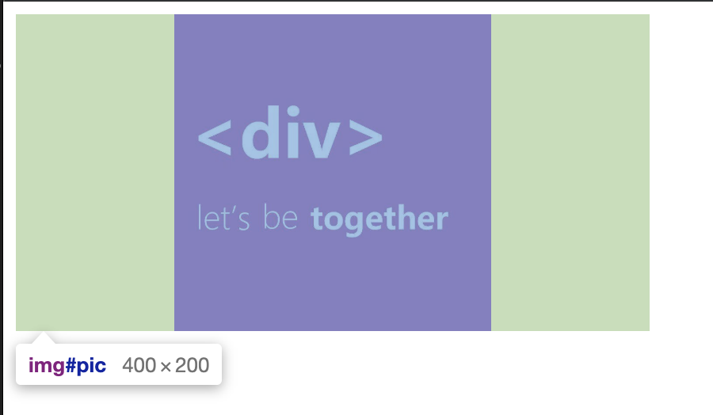

# 你TMD的竟然在代码里面下毒！

情景如下：

沈志勇，你看一下gitlab上面xxx的项目，这个是我们的一个老项目。我们要基于这个老点的框架,添加点新的功能。老大说到！

说实话，就怕接手老项目。里面的坑不知道有多少。皇天不负有心人，真的让我找到了一个坑。在一个公共组件里面，有个img图片不知何故，加了固定宽度，不仅加在了行间样式上，还给我加了‘!important’。看到代码的那一刻，我瞬间就：

简化一下，如下：

		
	
我现在要引用这个组件，且把图片的宽度改成200px。由于是公共组件，不能动组件内部代码，这可如何是好？

意外之中，张大佬又给了我曙光：

### 方法一：max-width

	max-width: 200px;

这个方法不仅兼容性好，而且简单明了。

### 方法二： 缩放

	zoom: .5
	
这个方法也不错。

### 方法三： box-sizing

	box-sizing: border-box;
	padding: 0 100px;
	
这个方法是解决了图片显示的问题，但是img的占位置还是有 400px
如图：

### 方法四： 

	transform: scale(.5)
	
这个方法对浏览器版本有点要求，而且还和方法三有同样的问题。

### 方法五：

	img{
		animation: change 0s forwards;
	}
	
	@keyframes change {
      from {
        width: 400px;
      }
      to {
        width: 200px;
      }
    }
    
 这个方法我是在网上看到的，不得不佩服这位大佬的思路。
 
 还有其他js的方法，这里就不列举了。
 
 （文中场景因剧情需要，均为虚构！）
 