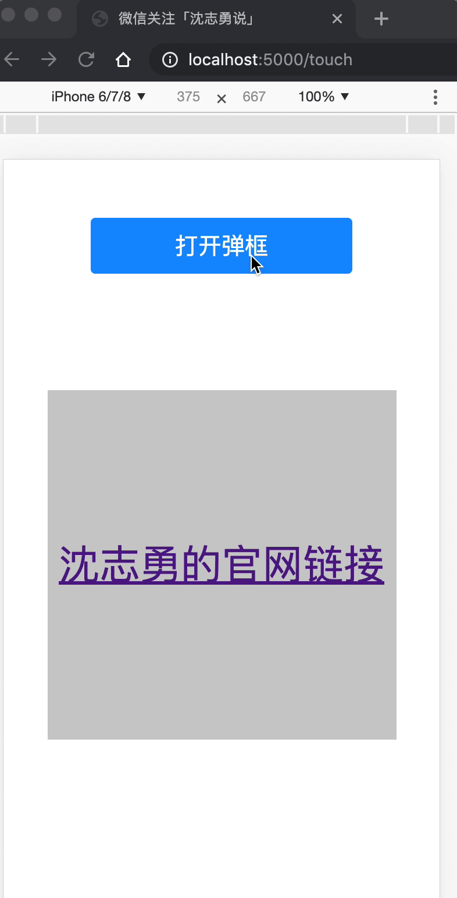

# 如何解决移动端击穿（穿透）问题

**在移动端开发的时候，我们有时候会遇到这样一个bug：点击关闭遮罩层的时候，遮罩层下面的带有点击的元素也会被触发，给人一种击穿了页面的感觉，这是为什么呢？**

为了让大家更直观的看到效果，我复现了bug,并录制了一个gif。供大家参考：

* 点击“打开弹框”按钮，显示遮罩层
* 点击“关闭弹框”按钮，遮罩层消失，底下的连接被触发



上图事例js部分代码

```javascript
var show = document.getElementById('show') // 打开按钮
var mask = document.getElementById('mask') // 遮罩层
var btn = document.getElementById('btn')   // 关闭按钮

show.onclick = function () {
    mask.style.display = 'block'
}

btn.addEventListener('touchstart', function () {
    mask.style.display = 'none'
}, false)

</body>
</html>

```
### 这样问题的形成原因是什么呢？

我们先来看一段代码：(以下代码需在移动端上运行)

```html
<div id="btn">我是一个按钮</div>
```


```javascript
var btn = document.getElementById('btn')
btn.addEventListener('touchstart', function () {
	console.log('start')	
}, false)

btn.addEventListener('touchmove', function () {
    console.log('move')
}, false)

btn.addEventListener('touchend', function () {
    console.log('touchend')
}, false)

btn.addEventListener('click', function () {
    console.log('click')
}, false)

```

以上代码会出现2种运行情况

* start ===> move ===> end
* start ===> end ===> click

看到这里相信大家都明白了，由于「关闭弹框」按钮绑定的事件是touch，a标签是click事件，在touch事件触发后，我们弹出框的遮罩层就消失了，这时候的click事件就被a标签给捕获到了，形成了击穿的效果。

### 方法一、阻止默认事件

```javascript
btn.addEventListener('touchend', function (e) {
    mask.style.display = 'none'
    e.preventDefault()
}, false)
```
在执行 touchstart 和 touchend 事件时，隐藏执行完隐藏命令后，立即阻止后续事件(推荐在touchend时，阻止后续的默认事件)

### 方法二、统一使用click事件

```javascript
btn.addEventListener('click', function () {
    mask.style.display = 'none'
}, false)
```

这个方法简单，就是交互的效率没有click事件高，另外，用户在touch的时候，有可能微微滑动了一下，就会无法触发点击事件。影响用户体验。

### 方法三、延迟执行
```javascript
btn.addEventListener('touchend', function () {
	setTimeout(function () {
        mask.style.display = 'none'  // 可以使用fadeOut动画
    }, 300)
}, false)
```
点击之后，我们不立即隐藏。让遮罩在350ms毫秒内淡出消失。（我为了演示方便就没有添加动画了，采用了定时器方法。）

### 方法四、 css属性pointer-events

```javascript
click.setAttribute('style', 'pointer-events:none')
mask.style.display = 'none'
setTimeout(function () {
    click.setAttribute('style', 'pointer-events:auto')
}, 350)
```
这样做法是，在遮罩消失之前，先让a标签忽略点击事件，这样遮罩层的点击事件，就不会被a标签捕获到。还是等350毫秒之后，再次赋予a标签的点击能力。这个方法跟方法三原理相似，只是利用了不同的css属性而已。个人觉得方法三比较好一点。方法四有明显的2个缺点：

1、遮罩层下面可能有多个带有事件的元素，那么你需要给所有可点击元素添加pointer-events属性 然后删除。不仅容易出错，还影响性能

2、如果用户在350毫秒内点击了元素，会造成页面失效的错觉，影响体验。

### 方法五、fastClick库

这个库的引用方法，在我上一篇文章中已经讲到。fastClick的原理就是使用了方法一的做法。fastClick 在 touchend 阶段 调用 event.preventDefault，然后通过 document.createEvent 创建一个 MouseEvents，然后 通过 event​Target​.dispatch​Event 触发对应目标元素上绑定的 click 事件。

后来有读者提了一个fastClick的bug。在这里我贴一下[解决方案](https://github.com/ftlabs/fastclick/issues/548)的地址

