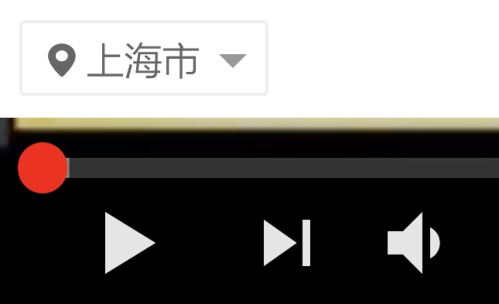
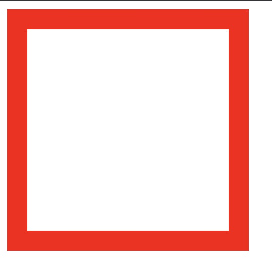
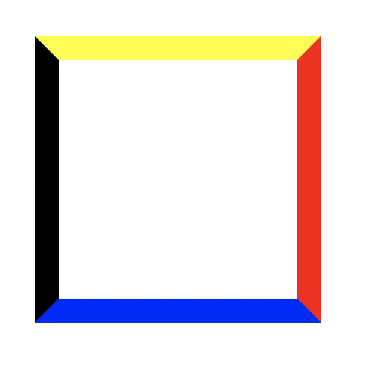
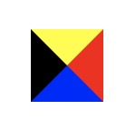
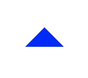
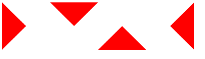
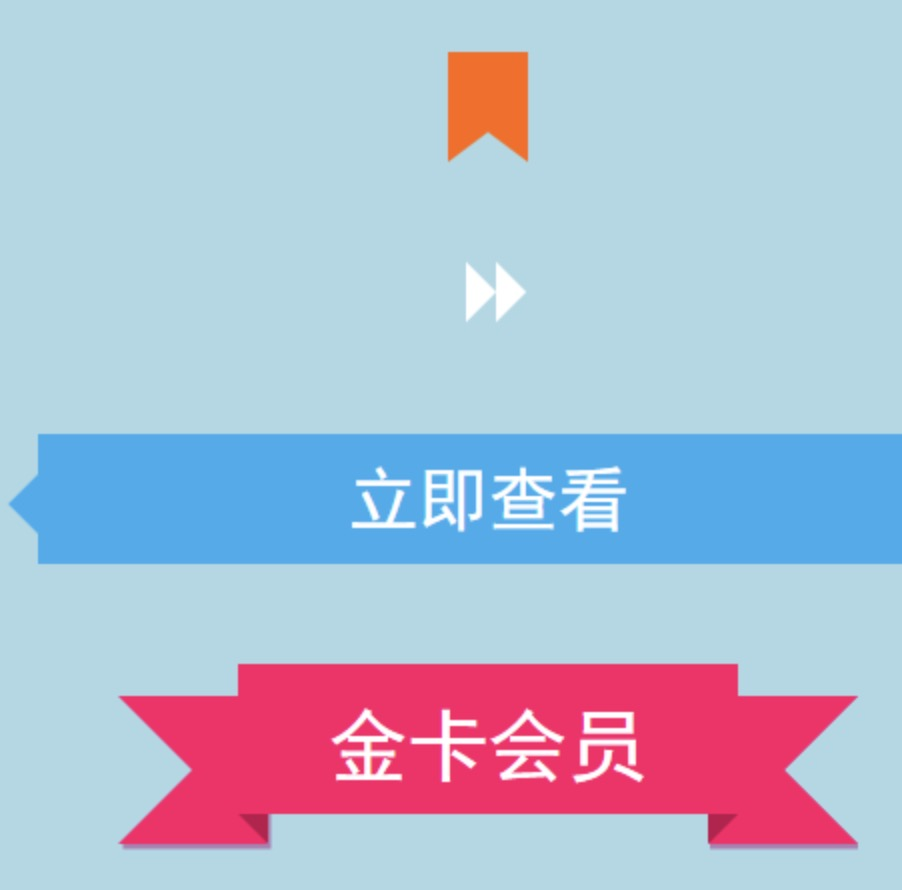

在前端开发的时候，我们有时候会需要用到一个三角形的形状，比如地址选择的时候，或者播放器里面播放按钮，快进快退按钮？

如下图所示：



我们通常情况下，会选择使用图片去做，或者使用svg去解决。我们今天换个法子，用css去实现。首先我们准备一个节点

```html
<div class="box"></div>
```

```css
.box{
  width: 200px;    
  height: 200px;
  border: 20px solid red;
}
```
我们就得到了一个四四方方的正方形



此时我们还没有看到什么不同，接下来我们把四个边框改成不同的颜色。

```
.box{
    width: 200px;
    height: 200px;
    border-right: 20px solid red;
    border-bottom: 20px solid blue;
    border-left: 20px solid black;
    border-top: 20px solid yellow;
}
```

我再来看效果图：



***看到这里相信大家都明白了，看到这里，相信大家明白了。其实css实现三角的原理就是利用了边框是梯形的这一属性。而且基本上还是等边梯形。接下来，我们把梯形的上边改为0，就得到了四个三角形***

```
.box{
    width: 0;
    height: 0;
    border-right: 20px solid red;
    border-bottom: 20px solid blue;
    border-left: 20px solid black;
    border-top: 20px solid yellow;
}
```


由于我们只需要一个蓝色的三角形，我们就把其他三边的颜色设置成透明色

```css
.box{
    width: 0;
    height: 0;
    border-right: 20px solid transparent;
    border-bottom: 20px solid blue;
    border-left: 20px solid transparent;
    border-top: 20px solid transparent;
}
```
就可以得到一个等边三角形了。



然后你通过不同修改，

bottom-left,
border-top,
bottom-right,
border-bottom,

即可得到下图



欢迎巧用三角形，实现更多效果：

放水完毕！！！